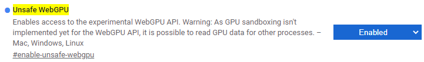
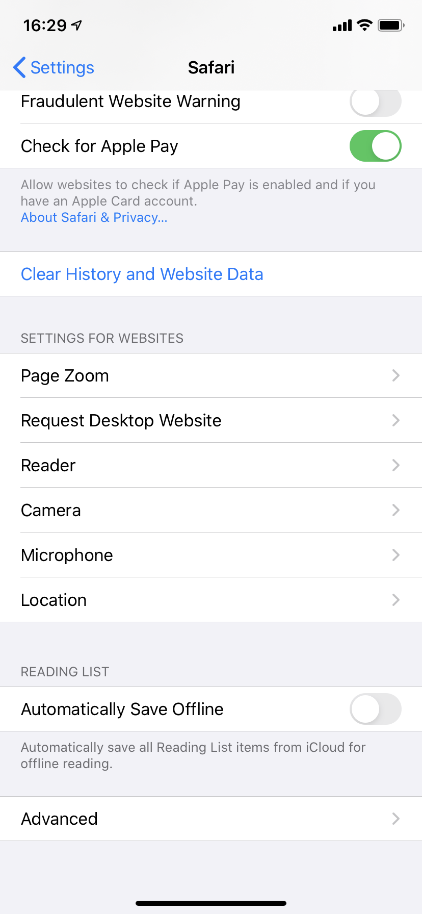
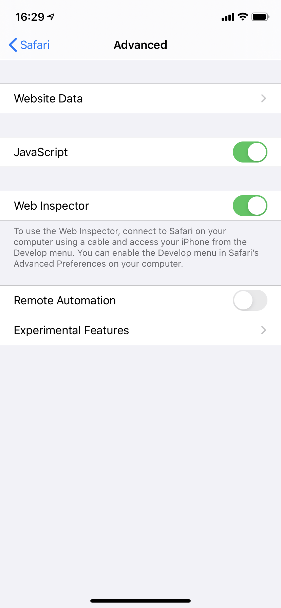
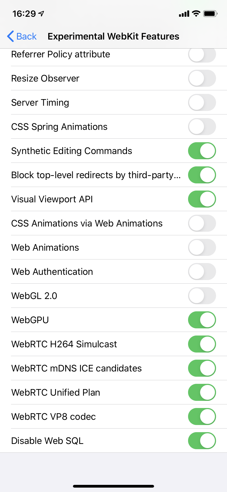

# WebGPU-BLAS

Fast matrix-matrix multiplication on web browser using [WebGPU](https://gpuweb.github.io/gpuweb/), future web standard.

The WebGPU standard is still in the process of being established and will not work in normal web browsers. There is also a possibility that the code will not work due to changes in the standard.

# Supported web browsers

- [Chrome Canary](https://www.google.com/chrome/canary/) (89.0.4359.0) on Windows, MacOS (maybe Linux)
  - Enabling WebGPU feature flag (from chrome://flags/#enable-unsafe-webgpu ) is needed.



- Safari 14 on macOS Catalina, iOS 13, iOS 14
  - See below to enable the experimental feature
  - Using WSL shading language, which is deprecated and will be removed in future release of Safari.

In macOS, menu bar -> Develop -> Experimental Features -> check "WebGPU"

In iOS 13, open Settings -> Safari -> Advanced -> Experimental Features -> Toggle "WebGPU"

<p float="left">




</p>

# Usage

Fetch `webgpublas.js` from [Releases](https://github.com/milhidaka/webgpu-blas/releases).

```javascript
// <script src="webgpublas.js"></script>
const [m, n, k] = [64, 64, 64];
const array_a = new Float32Array(m * k);//m*k row-major matrix
const array_b = new Float32Array(k * n);//k*n row-major matrix
// fill array_a, array_b
for (let i = 0; i < array_a.length; i++) {
  array_a[i] = Math.random();
}
for (let i = 0; i < array_b.length; i++) {
  array_b[i] = Math.random();
}
const alpha = 1.0;
const result = await webgpublas.sgemm(m, n, k, alpha, array_a, array_b);
console.log(result); // m*n row-major matrix (Float32Array)
```

# Limitation
## sgemm
- Input matrix "C" of ordinary blas is not yet supported.
- To use efficient implementation, the condition `m % 32 === 0 && n % 64 === 0 && k % 4 === 0 && alpha === 1.0` have to met.
- When the device / browser does not support WebGPU, fallback pure JavaScript implementation is used.

# Development

## Setup
```
yarn
```

## Build

For npm package
```
yarn build
```

For webpack single js
```
yarn webpack
```

## Shader compile

For shader for Chrome, SPIR-V binary format is needed.

SPRI-V can be compiled from text-based GLSL shader. To compile, use helper interface in `compile` directory.

GLSL shader is stored in `shader` directory. For example, `shader/sgemm_block.glsl` is compiled and stored in `src/shader_sgemm_block.ts`.

# License

MIT

`examples/sgemm/dist/weblas`: weblas by @waylonflinn
