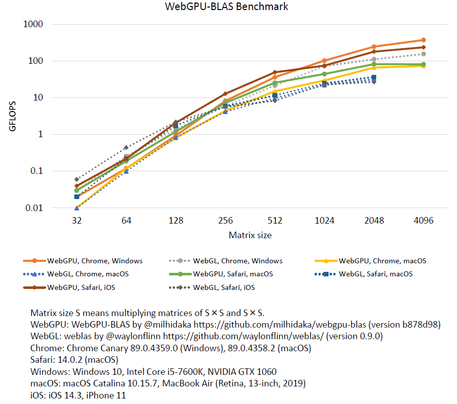

# WebGPU-BLAS (alpha version)

Fast matrix-matrix multiplication on web browser using [WebGPU](https://gpuweb.github.io/gpuweb/), future web standard.

The WebGPU standard is still in the process of being established and will not work in normal web browsers. There is also a possibility that the code will not work due to changes in the standard.

# Benchmark

Performance comparison of WebGPU and WebGL in terms of matrix-matrix multiplication in different hardwares and browsers. WebGL is the standard API as of 2020 for accessing the GPU. (As of February 2022, WebGPU on Safari does not work. Updating of this figure is needed.)



When using the WebGPU on Windows, 376 GFLOPS was achieved with a matrix size of 4096. This speed is 2.4 times faster than the speed of 156 GFLOPS when using WebGL.

# Supported web browsers

- Chrome (120) on Windows, MacOS

As of January 2024, WebGPU is not available in Safari. Experimental WebGPU implementation on iOS 13 was removed in iOS 15. [Older version for iOS 13](https://github.com/milhidaka/webgpu-blas/tree/7781151dce8569f67ac0282cf0b3e1ace80e2ca9)

# Usage

Fetch `webgpublas.js` from [Releases](https://github.com/milhidaka/webgpu-blas/releases).

```javascript
// <script src="webgpublas.js"></script>
const [m, n, k] = [64, 64, 64];
const array_a = new Float32Array(m * k);//m*k row-major matrix
const array_b = new Float32Array(k * n);//k*n row-major matrix
// fill array_a, array_b
for (let i = 0; i < array_a.length; i++) {
  array_a[i] = Math.random();
}
for (let i = 0; i < array_b.length; i++) {
  array_b[i] = Math.random();
}
const alpha = 1.0;
const result = await webgpublas.sgemm(m, n, k, alpha, array_a, array_b);
console.log(result); // m*n row-major matrix (Float32Array)
```

# Limitation
## sgemm
- Input matrix "C" of ordinary blas is not yet supported.
- To use efficient implementation, the condition `m % 32 === 0 && n % 64 === 0 && k % 4 === 0 && alpha === 1.0` have to met.
- When the device / browser does not support WebGPU, fallback pure JavaScript implementation is used.

# Development

## Setup
```
npm install
```

## Build

For npm package
```
npm run build
```

For webpack single js
```
npm run webpack
```

# License

MIT

`examples/sgemm/dist/weblas`: weblas by @waylonflinn
